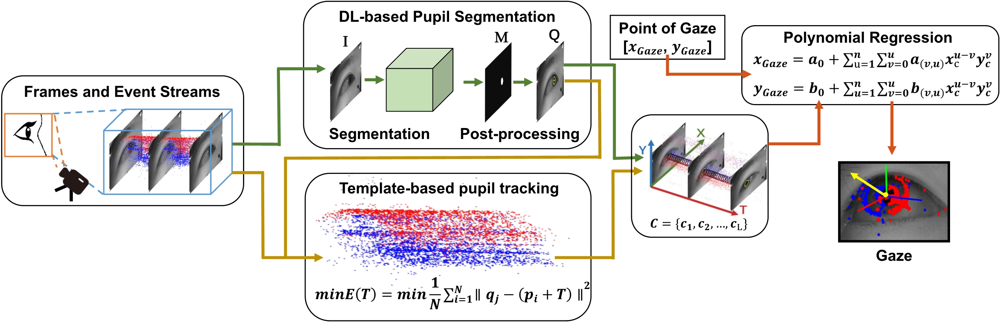
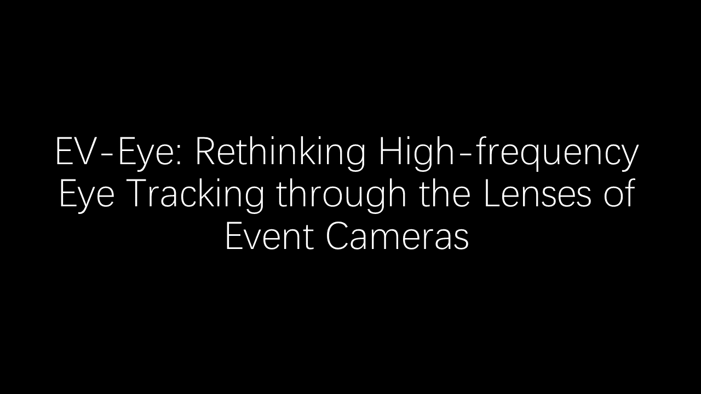
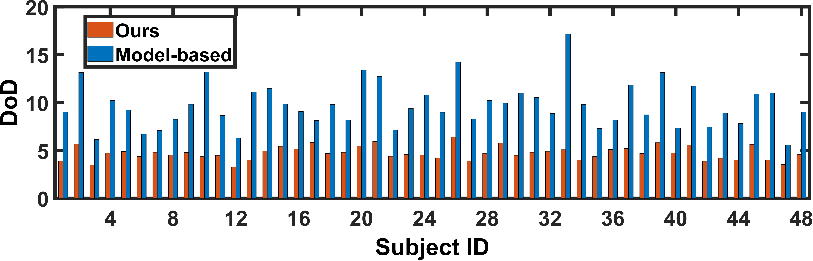
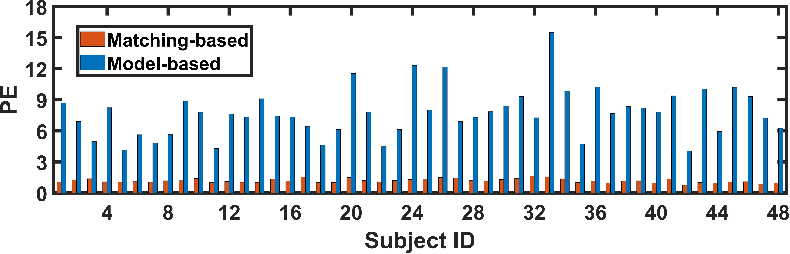
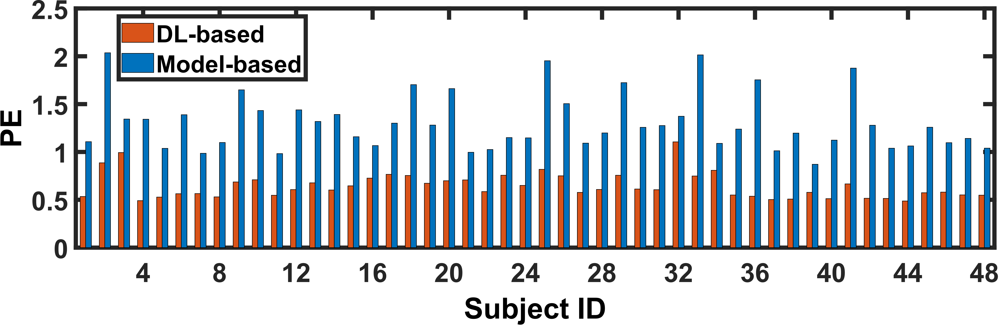
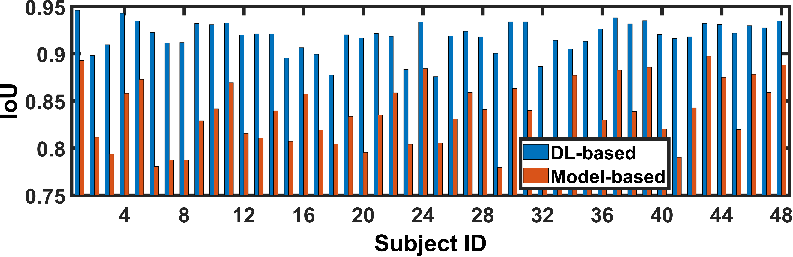

# EV-Eye: Rethinking High-frequency Eye Tracking through the Lenses of Event Cameras

## Introduction EV-Eye
We introduce the largest and most diverse multi-modal frame-event dataset for high frequency eyetracking in the literature (totally over 170Gb). 
We propose a novel hybrid frame-event eye tracking benchmarking approach tailored to the collected dataset, capable of tracking the pupil at a frequency up to 38.4kHz. 
<br/>
<br/>



<br/>

## A quick Youtube demo for introduction
[](https://youtu.be/Yi03mFAyslU)


## Dataset organization

You can download the data from   [https://1drv.ms/f/s!Ar4TcaawWPssqmu-0vJ45vYR3OHw](https://) ,which consists of

- raw_data

  Data_davis : From user1 to user48, all eye tracking data collected using event cameras, including data from left and
  right eyes, for each user including four sessions.
  ```
  ─Data_davis
  ├─user1
  │  ├─left
  │  │  ├─session_1_0_1
  │  │  │  ├─events
  │  │  │  └─frames
  │  │  ├─session_1_0_2
  │  │  │  ├─events
  │  │  │  └─frames
  │  │  ├─session_2_0_1
  │  │  │  ├─events
  │  │  │  └─frames
  │  │  └─session_2_0_2
  │  │      ├─events
  │  │      └─frames
  │  └─right
  │      ..........

  ```

  Data_davis_labelled_with_mask: Use the code in '/matlab_data_processing' to label the position of the pupils in frames
  captured by the event camera, and save the labels as an hdf5 file.
  ```
  ─Data_davis_labelled_with_mask
  ├─left
  │  ├─user1_session_1_0_2.h5
  │  │─user1_session_2_0_1.h5
  │  ..........
  ├─right
  │  ├─user1_session_1_0_2.h5
  │  │─user1_session_2_0_1.h5
  │  ..........
  ```

  Data_tobii: Eye tracking data collected using Tobii
  ```
  -Data_tobii
  ├─ user1 
  │  ├─tobiisend.txt
  │  ├─ tobiittl.txt
  │  ├─session_1_0_1
  │        ├─eventdata
  │        ├─gazedata
  │        ├─scenevideo
  │        ├─imudata
  ```
The following units and definitions are used throughout the API:
l Timestamps are always in seconds with decimals if nothing else is indicated.
l Gaze2D is in normalized video coordinates, (0,0) corresponds to the top left corner of the
scene camera video and (1,1) corresponds to the bottom right corner.
l Gaze3D is a position in millimeters from the scene camera, X is positive to the left, Y is positive up, and Z is positive forward.
l Gaze Origin is a position in the same coordinate system as Gaze3D.
l Gaze Direction is a normalized vector that starts in the gaze origin of the respective eye,
same coordinate system as Gaze3D.
l Pupil diameter is measured in millimeters.
l Accelerometer is measured in meter/second2 (m/s2).
l Gyroscope is measured in degrees/second (°/s).
l Magnetometer is measured in microtesla (μT).


- processed_data

  Data_davis_predict:
  Using the algorithm, estimated pupil images were obtained from the grayscale images for each user's session 102, 201,
  and 202.

  Frame_event_pupil_track_result:

  Pixel_error_evaluation:

  Pre-trained_models:

<br/>

## Requirements

```
python>=3.6
torch>=1.9.0
numpy>=1.21.0
tqdm>=4.61.1
h5py>=3.2.1
torchvision>=0.10.0
argparse>=1.1
```

To install requirements:

```angular2html
pip install -r requirements.txt
```

## Installation

```
pip install -r requirements.txt

cd ./dataset

#download processed_data

#unzip processed_data to 'dataset' folder
find /dataset/ -maxdepth 1 -name "*.zip" -exec unzip {} -d /dataset \

#download raw_data

#unzip raw_data to 'dataset' folder
unzip raw_data.zip -d /path/dataset

python train.py

python predict.py
```

[//]: # (<br/>)

## Training

To train the model(s) in the paper, run this command:

```
python train.py
```

## Pre-trained Models

You can download pretrained models here:

## Results







## Citation

If you would like to use our code or dataset, please cite either

```
@inproceedings{,  
  title={EV-Eye: Rethinking High-frequency Eye Tracking through the Lenses of Event Cameras},  
  author={Guangrong Zhao, Yiran Shen, Yurun Yang, Jingwei Liu, Ning Chen, Hongkai Wen, Guohao Lan},  
  year={2023}  
} 
```

<a rel="license" href="http://creativecommons.org/licenses/by-nc/4.0/"></a><br />
This work is licensed under a <a rel="license" href="http://creativecommons.org/licenses/by-nc/4.0/">Creative Commons
Attribution-NonCommercial 4.0 International License</a>.
