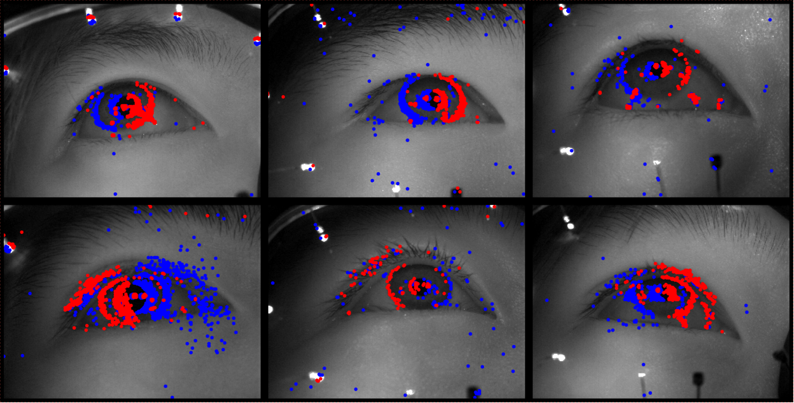

# EV-Eye: Rethinking High-frequency Eye Tracking through the Lenses of Event Cameras

## Introduction EV-Eye
We introduce the largest and most diverse multi-modal frame-event dataset for high frequency eyetracking in the literature (totally over 170Gb). 
We propose a novel hybrid frame-event eye tracking benchmarking approach tailored to the collected dataset, capable of tracking the pupil at a frequency up to 38.4kHz. 
<br/>
<br/>

<div style="display:flex;">
  
  
</div>

[//]: # (![summary]&#40;pictures/samples.png&#41;)

[//]: # ()
[//]: # (![summary]&#40;pictures/main.jpg&#41;)
<br/>


## Overview
The repository includes an introduction to EV-Eye Dataset organization and how to Running the benchmark in python and matlab.
<!-- ## A quick Youtube demo for introduction
[](https://youtu.be/Yi03mFAyslU)
 -->

## Dataset organization

You can download the data from [https://1drv.ms/f/s!Ar4TcaawWPssqmu-0vJ45vYR3OHw](https://1drv.ms/f/s!Ar4TcaawWPssqmu-0vJ45vYR3OHw), which consists of:

-**raw_data**

**Data_davis**: Including near-eye gryscale images in and event streams captured by two sets of DAVIS346 event cameras for "left" and "right" eyes.
Each user participates four sessions of data collection, the first two session capture both saccade and fixation states of the eye movement, the last two sessions record eye movement in smooth pursuit. 
We leverage the VGG Image Annotator on the [https://www.robots.ox.ac.uk/~vgg/software/via/via_demo.html](https://www.robots.ox.ac.uk/~vgg/software/via/via_demo.html) to label the pupil region of 9,011 near-eye images selected uniformly across the image dataset, annotation results are recorded in excel tables in the last three sessions, e.g., "raw_data/Data_davis/user1/left/session_1_0_1/user_1.csv". The creation_time.txt file records the system time when davis 346 started collecting.
  ```
  ─Data_davis
  ├─user1
  │  ├─left
  │  │  ├─session_1_0_1
  │  │  │  ├─events
  │  │  │  └─frames
  │  │  ├─session_1_0_2
  │  │  │  ├─events
  │  │  │  ├─frames
  │  │  │  └─user_1.csv
  │  │  ├─session_2_0_1
  │  │  │  ├─events
  │  │  │  ├─frames
  │  │  │  └─user_1.csv
  │  │  ├─session_2_0_2
  │  │  │  ├─events
  │  │  │  ├─frames
  │  │  │  └─user_1.csv
  │  │  ├─creation_time.txt
  │  └─right
  │      ..........
  ```
**Data_davis_labelled_with_mask**: Using the code in ``/matlab_processed/generate_pupil_mask.m`` to label grayscale images with annotation results in Data_davis, the results are saved as hdf5 files, which are then used for training the DL-based pupil segmentation network.
  ```
  ─Data_davis_labelled_with_mask
  ├─left
  │  ├─user1_session_1_0_2.h5
  │  ├─user1_session_2_0_1.h5
  │  │─user1_session_2_0_2.h5
  │  ..........
  ├─right
  │  ├─user1_session_1_0_2.h5
  │  ├─user1_session_2_0_1.h5
  │  │─user1_session_2_0_2.h5
  │  ..........
  ```


**Data_tobii**: The gaze references provided by Tobii Pro Glasses 3. The tobiisend.txt file records the system time when TTL signal is send to Tobii Pro Glasses 3, the tobiittl.txt records
the TTL signal receiving time in the glasses internal clock. The detailed introduction about gazedata, scenevideo, imudata and eventdata can be find in: [https://www.tobii.com/products/eye-trackers/wearables/tobii-pro-glasses-3#form](https://www.tobii.com/products/eye-trackers/wearables/tobii-pro-glasses-3#form) 
  ```
  -Data_tobii
  ├─ user1 
  │  ├─tobiisend.txt
  │  ├─tobiittl.txt
  │  ├─session_1_0_1
  │        ├─gazedata
  │        ├─scenevideo
  │        ├─imudata
  │        ├─eventdata
  ```

To access more information about the setup and data curation process, kindly refer to Section 3 of the corresponding paper.


- processed_data  

**Pre-trained_models**: DL-based Pupil Segmentation network pre-trained models trained using the left and right eyes of each of the 48 participants.

**Data_davis_predict**: Binarized masks of 48 participants that extract the pupil area out of the background using pre-trained_models.

**Frame_event_pupil_track_result**: Using the code in ``/matlab_processed/frame_event_pupil_track.m`` to obtain frame&event-based pupil tracking results, i.e., Point of Gaze (PoG) for 48 participants, and a corresponding visualization code is in ``/matlab_processed/frame_event_pupil_track_plot.m``. 

**Pixel_error_evaluation**:  Using the code in ``/matlab_processed/pe_of_frame_based_pupil_track.m`` and ``/matlab_processed/pe_of_event_based_pupil_track.m`` to estimated Euclidean distance in pixels between the estimated and groundtruth pupil centers.
 
<br/>


## How to use

Note: please use Python >= 3.6.0
### Requirements

```
torch>=1.9.0
numpy>=1.21.0
tqdm>=4.61.1
h5py>=3.2.1
torchvision>=0.10.0
argparse>=1.1
```

To install requirements:

```angular2html
pip install -r requirements.txt
```
### Download Dataset
Download the **raw_data** and **processed_data** folders to the **'/dataset'** folder and run 
```
cd /path/dataset #choose your own path

#upzip

find . -mindepth 2 -maxdepth 2 -name '*.rar' -execdir unrar x {} \; -execdir mv {} ./ \;
```

### Training

To train the DL-based Pupil Segmentation network models in the paper, run this command:

```
python train.py 
```

Optional arguments can be passed :
* `direction` direction of dataset to be used,such as 'L' or 'R'.
* `save_checkpoint` Whether to save the checkpoint or not,default mode is true.
* `batch_size ` Batch size to use for training.

### Predict

```angular2html
python predict.py
```
Optional arguments can be passed :
* `direction` direction of dataset to be used,such as 'L' or 'R'.
* `--predict` the user ID to be estimated, for example, '1'. 
* `--output` The output directory for the prediction results, default '/predict_results'.

[//]: # (## Results)

[//]: # (##### IoUs and F1 scores on frame-based pupil segmentation.)

[//]: # ()
[//]: # (<br/>)

[//]: # (<div style="display:flex;">)

[//]: # (  )

[//]: # (  )

[//]: # (</div>)

[//]: # ()
[//]: # ()
[//]: # (<br/>)

[//]: # ()
[//]: # (##### The pixel error of frame-based and event-based pupil tracking.)

[//]: # ()
[//]: # (<br/>)

[//]: # ()
[//]: # ()
[//]: # (![event]&#40;pictures/event_pixel.png&#41;)

[//]: # (![frame]&#40;pictures/frame_pixel.png&#41;)

[//]: # ()
[//]: # (<br/>)

[//]: # ()
[//]: # (##### DoDs of model-based method vs. ours with respect to the gaze references.)

[//]: # ()
[//]: # (<br/>)

[//]: # ()
[//]: # ()

## Citation

If using this code-base and/or the EV-eye dataset in your paper, please cite the following publication:

```
@inproceedings{,  
  title={EV-Eye: Rethinking High-frequency Eye Tracking through the Lenses of Event Cameras},  
  author={Guangrong Zhao, Yiran Shen, Yurun Yang, Jingwei Liu, Ning Chen, Hongkai Wen, Guohao Lan},  
  year={2023}  
} 
```

<a rel="license" href="http://creativecommons.org/licenses/by-nc/4.0/"></a><br />
This work is licensed under a <a rel="license" href="http://creativecommons.org/licenses/by-nc/4.0/">Creative Commons
Attribution-NonCommercial 4.0 International License</a>.
